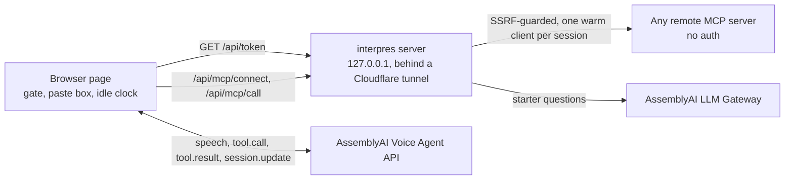

# interpres

**Make any MCP server talkable.** Paste a remote MCP server's URL, press Talk, and
AssemblyAI's Voice Agent API calls that server's tools live, out loud.

- **Live:** <https://interpres.ochinimus.app>
- **Judges:** [JUDGE_GUIDE.md](JUDGE_GUIDE.md), a five-minute path through it.
- No microphone? The page has "Watch a real session": a recorded conversation,
  replayed with its transcript and tool calls appearing at their real times.

## Why

OpenAI's Realtime API has a native `mcp` tool type: you hand it a `server_url`
and the API executes the remote MCP server's tools for you. AssemblyAI's Voice
Agent API has only `function` (client-side) and `http` (server-side) tools — no
MCP. AssemblyAI's
[Voice Agent API page](https://www.assemblyai.com/products/voice-agent-api) lists
it at $4.50/hr and OpenAI Realtime at $18.00/hr, and its
[Sep 22 migration guide](https://www.assemblyai.com/blog/migrating-from-openai-realtime-api-to-assemblyai-voice-agent-api)
from Realtime never mentions MCP, so every team that migrates silently loses its
MCP tools.

interpres is the missing adapter.

## How it works



1. **Connect.** The server asks the MCP server for its tools once (`initialize` and
   `tools/list`) and converts every tool into a Voice Agent function tool. It
   plans the first phase: at most 10 tools, with `find_tools` to swap in the rest.
   The LLM Gateway writes three starter questions for the page.
2. **Talk.** The browser opens the Voice Agent WebSocket with a temporary token.
   The API key never leaves the server. Speech goes in, and tool calls come back.
3. **Call.** Every tool call passes the gate in the browser, then goes to
   `/api/mcp/call`. The server calls the MCP tool on a warm client through the
   SSRF guard and shapes the result into at most 600 characters of speech. The
   browser returns it as `tool.result`.

## AssemblyAI features used

- **Voice Agent API:**
  - a WebSocket session with PCM16 audio at 24 kHz;
  - client-side function tools, with `execution_mode` set on every tool;
  - `session.update` mid-session, to swap tools, keyterms and prompt;
  - `input.keyterms`, built from the catalog and from what the person pastes;
  - the greeting, barge-in (`reply.done` with status `interrupted`) and `session.end`;
  - temporary tokens, with `expires_in_seconds` and `max_session_duration_seconds`.
- **Session History:** turn timelines and recordings, read back for
  `docs/PROOF.md`, the spoken sweep and the replay.
- **LLM Gateway** (`qwen3.5-4b-32k-fast`): starter questions at connect time.
  Result refinement is also available, and off by default.

## The numbers

Copied verbatim from the generated pages by `scripts/docs-quote.ts`, never retyped.

**The registry sweep** ([docs/SWEEP.md](docs/SWEEP.md)): every server in the official MCP
registry with a remote, probed without auth.

<!-- quote:sweep-headline -->
|  | count |
| --- | ---: |
| Registry entries (every version) | 119,873 |
| Unique servers (latest version each) | 36,251 |
| With a streamable-http or sse remote: probed | 22,217 |
| Distinct hosts probed | 14,675 |
| `ok`: listed its tools without auth | 12,012 (54.1%) |
| ... on distinct hosts | 7,347 |
| `ok` with at least one tool | 12,006 |
| `ok` with more than 10 tools (find_tools engages) | 5,474 (45.6%) |
| Tools per `ok` server: median / 90th percentile / max | 9 / 31 / 627 |
| `ok` by transport | streamable-http 11,969, sse 43 |
| Tools listed by `ok` servers | 202,191 |
| Tools converted to Voice Agent function tools | 202,191 (100.0%) |
| Converted tools carrying spoken-format hints | 36,059 (17.8%) |
| `ok` again at the recheck | 11,578 of 12,012 (96.4%); 99.5% without the host that rate-limited the sweep |
<!-- /quote:sweep-headline -->

**The spoken sweep** ([docs/VOICE-SWEEP.md](docs/VOICE-SWEEP.md)): the first 30 no-auth
servers with a read-only tool, in registry order, each asked a question out loud.

<!-- quote:voice-sweep-counts -->
| | count |
| --- | ---: |
| servers attempted | 30 |
| connected | 30 |
| starter from the LLM Gateway / from templates | 29 / 1 |
| voice sessions run | 29 |
| session failed to open (the API's own session.error) | 1 |
| a tool was called | 17 |
| MCP call succeeded / tool answered with an error / held by the gate | 14 / 3 / 0 |
| the agent answered out loud | 29 |
| median voice-to-voice, answered turns | 2597 ms |
| session time, and its cost at $4.50/hr | 482 s, $0.60 |
<!-- /quote:voice-sweep-counts -->

**Session History** ([docs/PROOF.md](docs/PROOF.md)): every recorded session, read back
from AssemblyAI.

<!-- quote:proof-summary -->
| | |
| --- | ---: |
| sessions | 93 |
| tool calls | 136 |
| tool calls answered with no error flag (Session History `is_error`) | 136 of 136 (100.0%) |
| median tool latency | 936 ms (n=135) |
| median time to first audio | 881 ms (n=14 turns that report it) |
| session time | 2307 s |
| cost, computed from the published $4.50/hr (not read from a bill) | $2.88 |
<!-- /quote:proof-summary -->

## Result shaping, and the LLM Gateway

MCP tools answer to a text-model reader: JSON, markdown tables, 20-50 KB search
dumps. Read aloud, that is unusable, so every large or structured result is
turned into at most 600 characters of plain speech before the agent sees it.

**The local path is primary.** A deterministic extractive summariser in
`packages/core/src/extract.ts` strips what has no spoken form (URLs, markdown,
table rules, record labels), scores sentences against the caller's question,
and returns at most four of them in document order. Every sentence it speaks
appears in the tool output; it cannot invent a fact.

**Speech never waits on the LLM Gateway.** Gateway refinement is off unless
`SHAPER_REFINE=on`, because it was measured and found to cost audible silence:
across 20 tool-calling turns of real speech, the agent never spoke a transition
phrase before calling a tool (0 of 20), so the time between `tool.call` and the
result is silence the caller hears. With refinement on, the Gateway added
582-1,133 ms of it to every call it refined, and median voice-to-voice rose from
4,476 ms to 5,208 ms. When switched on, it still cannot fail a turn: the local
answer is computed first, the Gateway gets a hard 1.5 s to replace it, and a
circuit breaker skips it for 60 s after any `429`.

**Which Gateway models this account can reach** (measured 2026-09-26, Free plan
with hackathon credits):

| model id | result |
|---|---|
| `qwen3.5-4b-32k-fast` | **200 - used for refinement** |
| `gemini-2.5-flash`, `gemini-3.8-flash` | 400 "Your account does not have access to this LLM Gateway model" |
| `claude-haiku-4-5-20251001` | 400, same |
| `gpt-5-nano`, `gpt-oss-20b` | 400, same |
| `gemma-4-31b`, `nemotron-nano-9b-v2`, `deepseek-v4.1-flash` | 400, same |

`qwen3.5-4b-32k-fast` is the model AssemblyAI serves itself. It is also
rate-limited hard on this plan: 4 of 6 sequential calls returned
`429 "too many requests for this action"`, which is why the breaker exists.
Set `SHAPER_REFINE=on` to use it, and `SHAPER_MODEL` to use another model on an
account that can reach one.

**Where the Gateway does run by default is off the speech path: starter
questions.** At connect time it writes three questions a person could say to the
server, from its read-only tools only. They appear as "Try asking" chips, marked
with their source. When the breaker is open, or on a 429, a timeout or unusable
output, templates built from the tools' own descriptions stand in, and the page
says so.

## Warm MCP connections

A tool call used to open a new MCP client every time, over a new connection:
DNS, TCP and TLS, then `initialize`, `notifications/initialized`, `tools/call`
and a close. All of that happened while the caller waited in silence. Now:

- Each voice session keeps one MCP client per server. It is closed after 60 s
  idle, at most 32 are held (least recently used out first), and it is reopened
  once if the server has forgotten the session.
- Each verified host keeps one keep-alive connection pool. The host is checked
  against the SSRF rules again every 30 s, so the address pin still holds.

Measured with the spoken suite: the same six presets and 11 turns each way,
`MCP_WARM=off` against the default. `scripts/warm-ab.ts` computes these from the
two data files:

| median | off | on |
|---|---|---|
| MCP call | 867 ms | 481 ms |
| MCP call, later in a session | 806 ms | 311 ms |
| voice-to-voice | 3,504 ms | 3,020 ms |

These were measured from the development machine. Round trips from the demo
server are different.

## Identifiers and state-changing tools

**Voice for intent, keyboard for identifiers, and nothing misheard gets executed.**

Speech-to-text cannot carry a long identifier. In every recorded run, a spoken
identifier came through exact **0 times out of 7**. `node scripts/spoken-identifiers.ts`
recounts that from `data/`. It fails in four ways:

1. **A repetition loop.** `0x` followed by 39 zeros and a `1` came back as `0x`
   followed by 693 zeros, with no `1`.
2. **Lost characters.** Doubled letters merge: `5 a a e b` became `5aeb`, so the
   value was 40 characters where 42 were said. A single one vanishes too: `3 f 9 a 1 c`
   became `3f91c`.
3. **Inserted characters.** `... 6 c 0 e 9 b ... 5 c 8 e ...` became
   `... 6ce0e9b ... 5cade ...`, 44 characters.
4. **A valid-looking wrong value.** The same address came back as
   `... 6ce09b ... 5cad ...`. That is still 42 characters, but a *different* address,
   and the server answered confidently about a wallet nobody asked for.

Names fail too: in a live test "ochinimus.app" was heard as "okinimus.app".

So a gate sits in front of every MCP request, in the browser and in both proof
scripts:

- **An identifier-shaped argument must come from the keyboard.** That means `0x`
  plus 16 or more hex characters, 24+ hex or base58 characters mixing digits and
  letters, a UUID, or 16+ characters without spaces holding at least 3 digits and 3
  letters.
  - It runs only if it appears verbatim in the paste box or in an earlier tool
    result. Hex is compared case-insensitively, base58 exactly. A result that only
    echoes the argument it was sent does not count.
  - Otherwise no request is made. The agent gets `needs_paste`, says it may have
    misheard, and asks for a paste. The page shows the heard value in large type,
    grouped in fours, and puts the cursor in the paste box.
  - **There is no voice path past this: not even "yes, that's right".** That
    sentence once confirmed an address whose middle was misheard (`5c8e` became
    `5cad`) while its last four characters were right, and the wrong value ran
    (`sess_c7ecda9ca1ca4a3f8eebfb18378bd139`). The same test now makes 0 MCP calls
    after the yes (`sess_2762c5ea28bc4b1f99dbe0a3c2b8fe4f`). The paste path makes
    exactly 1, and the sha256 of the pasted value matches the one the server received
    (`sess_5ddb040c77e24c3181d6d7cb60799b10`).
  - If the server's own schema has a `pattern` for that argument and the value
    fails it, the answer is `invalid`: paste it.
- **A tool that changes state needs a spoken yes.** That is `destructiveHint`, or
  no `readOnlyHint` and a name whose first word (after any prefix every tool shares)
  is a write verb such as create, send, transfer or sign.
  - It is held with `needs_confirmation`, and the line names what it will do and on
    which server.
  - An identical repeat within 120 s, after the person says yes, runs exactly once.
    A changed repeat is held again.
  - If its arguments carry a spoken identifier, the identifier rule applies first.
- Digit-only strings are **not** treated as identifiers yet: card numbers, phone
  numbers and order numbers pass through. That is the next thing to add.

**The paste box** under the Talk button is the other half. Its text reaches tools
through a built-in `use_pasted_text` tool, verbatim: measured, the sha256 of the
pasted address equalled the sha256 of the argument the MCP server received. Its
word parts also become keyterms, which fixes names: "check ochinimus dot app"
was transcribed correctly 3 times out of 3 with the pasted keyterm, and 0 out of 3
without it (heard as "aginimus").

## Measured against the docs

AssemblyAI's documentation was re-read on 2026-09-26 through its own docs MCP
server. Two behaviours differ from it, and both reproduce with
`scripts/e2e-audio.ts`.

**1. Interactive mode speaks no transition phrase.**
- What the docs say: `tools/overview.mdx` ("Execution modes") says to default to
  `interactive`, and its sequence diagram has the agent say "let me check that"
  before `tool.call`. `client-side-tools.mdx` gives `execution_mode` a default
  of `"interactive"`.
- Every tool interpres sends sets that field explicitly. Session History's copy
  of the `session.update` for `sess_8dfc36d82b21496781ff85d48145ad04` shows all
  7 tools with `"execution_mode": "interactive"`.
- Across the spoken suite (`data/e2e-audio-execmode.json`), the agent spoke 0 ms
  of audio before the tool call in 14 of 14 calls. At CHECKPOINT A, before the
  field was set, it was 0 of 20.
- Session History agrees: the turns that call a tool have no reply start and no
  time to first audio.
- A prompt line asking for a phrase changed nothing either (6 of 6 turns silent).

So a tool call is silence the caller hears; warm connections (above) are what
shorten it. To reproduce, run `node --env-file=.env scripts/e2e-audio.ts` and read
its `timing` lines: "transition phrase 0ms of audio".

**2. `audio_duration_seconds` is null although audio was streamed.**
- What the docs say, in `events-reference.mdx`: "Total audio you streamed in.
  `null` if you streamed none."
- In `sess_11e6597b5a6a4b96945eff34cb9911cc` the harness streamed 446 chunks of
  40 ms (17.8 s), and the agent heard "What books does Bill Gates recommend?".
- `session.ended` still said `"audio_duration_seconds": null`, with
  `session_duration_seconds` at 18.3.

To reproduce, run `node --env-file=.env scripts/e2e-audio.ts --preset <url> --say
"<question>"`: every result now keeps the server's `session.ended` verbatim, under
`ended`. Take `transcript.user` as the proof that audio arrived.

## Limits and security

- **No-auth servers only.** interpres never sends a credential to an MCP server,
  and the AssemblyAI key stays on the server: the browser gets a temporary token.
- **The SSRF guard** covers every request either MCP transport makes:
  - https only;
  - every resolved address must be publicly routable, and the socket is pinned
    to those addresses;
  - redirects are refused;
  - a 10 s timeout and a 512 KB response cap;
  - warm hosts are verified again every 30 s.
- **Spend:**
  - 6 sessions per IP per hour and 100 per UTC day;
  - 300 s per session;
  - a session ends after 60 s in which nobody speaks.
  - When the cap is hit, the page plays the recorded session instead of an error.
- **Nothing misheard runs:** see "Identifiers and state-changing tools" above.
  Digit-only identifiers are not gated yet.
- **Privacy:** logs hold tool names and timings, never an IP address. The public
  status endpoint shows hosts, never full URLs or what anyone said.
- **Measured limits:**
  - a tool call is silence the caller hears (see "Measured against the docs");
  - the LLM Gateway rate-limits this account, and templates stand in;
  - a phase shows at most 10 tools.

## Run it

```bash
npm ci && npm run build
```

```bash
npm run dev:local
```

The second command serves the app at <http://localhost:3030>. First put
`ASSEMBLYAI_API_KEY=...` in a `.env` file at the repo root; it never reaches the
browser.

```bash
npm test
```

`npm test` runs every unit and protocol test with no network. It passes in a macOS
sandbox that denies all outbound traffic except to localhost:
`sandbox-exec -p '(version 1)(allow default)(deny network-outbound)(allow network-outbound (remote ip "localhost:*"))' npm test`.
`npm run test:live` adds the tests that reach real servers.

```bash
node --env-file=.env scripts/e2e-audio.ts --preset https://mostrecommendedbooks.com/api/mcp --say "Who recommends Sapiens?"
```

That is the main proof path: real speech from macOS `say`, streamed into a live
session.

The package in `packages/core` is staged for npm as `interpres` by
`node scripts/npm-pack.ts`.

## License

MIT — see `LICENSE`.

The common-word list that keeps everyday words out of speech-to-text keyterms
(`packages/core/src/english-10k.ts`) is the top 10,000 words of
[IlyaSemenov/wikipedia-word-frequency](https://github.com/IlyaSemenov/wikipedia-word-frequency),
MIT licence, Copyright (c) 2015 Ilya Semenov. The full notice is in
`packages/core/THIRD_PARTY_LICENSES.md`.
